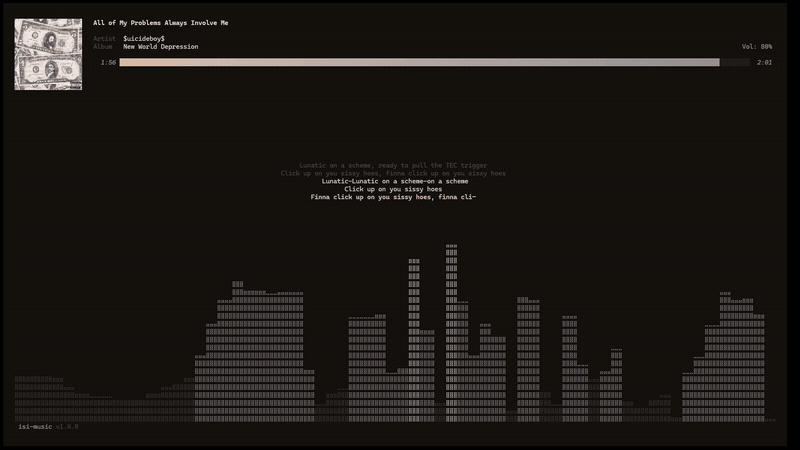
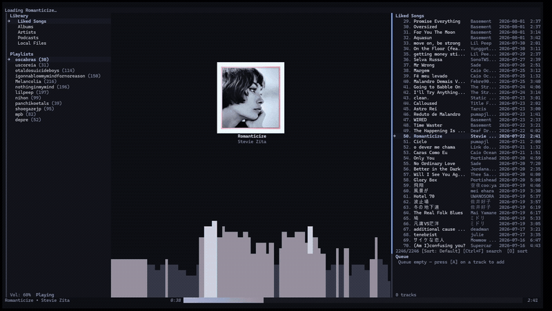
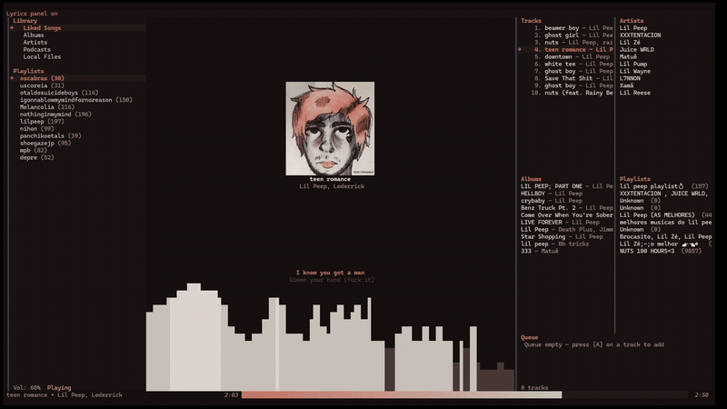
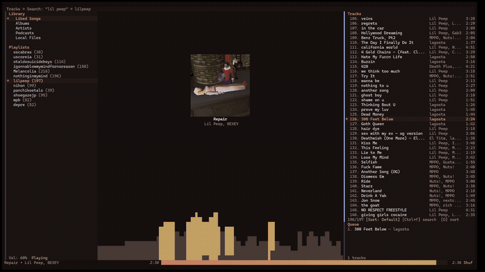

<p align="center">
  
</p>

<h1 align="center">isi-music</h1>

<p align="center">Spotify and local music in the terminal.</p>

<p align="center">
  <a href="https://github.com/glrmrissi/isi_music/releases/latest"></a>
  <a href="https://github.com/glrmrissi/isi_music/releases"></a>
  <a href="https://github.com/glrmrissi/isi_music/stargazers"></a>
  <a href="https://github.com/glrmrissi/isi_music/actions/workflows/ci.yml"></a>
  <a href="https://github.com/glrmrissi/isi_music/blob/master/LICENSE"></a>
  <a href="https://github.com/glrmrissi/isi_music#installation"></a>
  <a href="https://github.com/glrmrissi/isi_music#installation"></a>
</p>

isi-music is a terminal audio player for Spotify and local music, built in Rust with Ratatui. It combines Spotify streaming, local files, album art, a visualizer, lyrics, and desktop integrations in one TUI.

> Spotify Premium is required for streaming. Local playback does not require a Spotify account.

<table>
  <tr>
    <td align="center"></td>
    <td align="center"></td>
  </tr>
  <tr>
    <td align="center" colspan="2"><video src="https://github.com/user-attachments/assets/7efd70f0-72cb-4ff7-8c68-a0a38f7ceecf" controls width="800"></video></td>
  </tr>
  <tr>
    <td align="center"></td>
    <td align="center"></td>
  </tr>
</table>

## Installation

### Quick install

The installers download the latest release, install Linux audio dependencies when needed, and start the setup wizard.

**Linux**

```bash
curl -fsSL https://raw.githubusercontent.com/glrmrissi/isi_music/master/scripts/install.sh | bash
```

**Windows PowerShell**

```powershell
irm https://raw.githubusercontent.com/glrmrissi/isi_music/master/scripts/install.ps1 | iex
```

On Windows, the installer adds the program to the user `PATH` and creates a Start Menu shortcut when Windows Terminal is available.

### Homebrew (Linux)

```bash
brew tap glrmrissi/isi-music
brew install isi-music
```

### Manual download

**Linux**

```bash
curl -L https://github.com/glrmrissi/isi_music/releases/latest/download/isi-music-linux-x86_64 -o isi-music
chmod +x isi-music
sudo mv isi-music /usr/local/bin/
```

**Windows**

```powershell
Invoke-WebRequest -Uri https://github.com/glrmrissi/isi_music/releases/latest/download/isi-music-windows-x86_64.exe -OutFile isi-music.exe
mkdir "$env:LOCALAPPDATA\Programs\isi-music" -Force
move isi-music.exe "$env:LOCALAPPDATA\Programs\isi-music\"
```

### Linux dependencies

| Distribution | Command |
| --- | --- |
| Debian / Ubuntu | `sudo apt install libasound2t64 libpulse0` |
| Arch Linux | `sudo pacman -S alsa-lib libpulse` |
| Fedora | `sudo dnf install alsa-lib pulseaudio-libs` |

Windows uses WASAPI and does not need additional audio packages. Windows Terminal is recommended for true color and mouse support.

## First run

Start the wizard:

```bash
isi-music setup
```

For a specific setup step:

```bash
isi-music setup-spotify
isi-music setup-lastfm
isi-music doctor
isi-music update
```

The Spotify setup uses your custom Client ID for the Web API and the built-in librespot Client ID for streaming. Configure both OAuth accounts at startup. Leave the Web API Client ID blank for streaming-only mode.

## Spotify authentication

The Web API uses your own Spotify Developer Client ID. The built-in librespot Client ID is used only for streaming.

Run:

```bash
isi-music setup-spotify
```

Enter your Web API Client ID and add this redirect URI to your Spotify Developer app:

```text
http://127.0.0.1:8888/callback
```

The setup then opens the second OAuth flow for librespot streaming using its registered redirect URI:

```text
http://127.0.0.1:8898/login
```

Both authentications happen during setup/startup. No `client_secret` is required because the flow uses PKCE. Leave the Web API Client ID blank to use streaming-only mode.

## Usage

### TUI controls

| Key | Action |
| --- | --- |
| `Tab` / `Shift+Tab` | Move between panels |
| `↑` / `↓` or `j` / `k` | Navigate |
| `Ctrl+↑` / `Ctrl+↓` | Jump to first or last item |
| `M` | Jump to middle of list |
| `PageUp` / `PageDown` | Scroll up or down |
| `1` / `2` / `3` / `4` | Focus Library, Playlists, Tracks, or Queue |
| `Enter` | Play, open an album, or open an artist |
| `Esc` | Go back |
| `Space` | Play or pause |
| `n` / `p` | Next or previous track |
| `s` | Toggle shuffle |
| `r` | Cycle repeat mode |
| `+` / `-` | Change volume |
| `←` / `→` | Seek five seconds |
| `5` | Seek to middle of track |
| `/` | Search |
| `Ctrl+F` | Quick search |
| `c` | Jump to the playing track |
| `a` | Add the selected track to the queue |
| `Delete` | Remove from queue |
| `l` | Like the current track |
| `o` | Sort tracks |
| `A` | Add to playlist |
| `D` | Remove from playlist |
| `Alt+D` | Delete playlist |
| `z` | Toggle fullscreen |
| `m` | Toggle compact mode |
| `v` | Toggle visualizer |
| `y` | Toggle lyrics |
| `t` | Open options |
| `:` | Command prompt |
| `Ctrl+Y` | Copy track link |
| `Shift+B` | Toggle breadcrumb |
| `d` | Toggle debug overlay |
| `?` | Open help |
| `q` or `Ctrl+C` | Quit |

All keybindings can be overridden in `keybinds.toml`.

### CLI commands

```bash
isi-music --status
isi-music --devices
isi-music --device <name>
isi-music --next
isi-music --prev
isi-music --toggle
isi-music --vol+
isi-music --vol-
isi-music --playlists
isi-music --play <ID|name>
isi-music --liked [--limit N]
isi-music --search <query>
isi-music --search-global <query>
isi-music --ls [--limit N]
isi-music --play-id <N>
isi-music --clear-logs
isi-music update
```

### Daemon mode

Keep Spotify playback running in the background:

```bash
isi-music --daemon
isi-music --play spotify:playlist:37i9dQZF1DXcBWIGoYBM5M
isi-music --liked
isi-music --ls
isi-music --play-id 2
isi-music --status
isi-music --quit-daemon
```

Daemon logs are stored at `~/.local/share/isi-music/isi-music.log` on Linux and in the platform data directory on Windows. Local file playback is available in TUI mode.

## Local files

Set a music directory in `config.toml`:

```toml
[local]
music_dir = "~/Music"
```

On Windows, use forward slashes:

```toml
music_dir = "C:/Users/you/Music"
```

Supported formats are MP3, FLAC, Opus, Ogg Vorbis, and WAV. Select **Local Files** in the Library and press Enter to scan. Metadata and embedded cover art are cached in SQLite.

Spotify and local tracks can be mixed in the same queue.

## Configuration

Configuration files live in:

| Platform | Location |
| --- | --- |
| Linux | `~/.config/isi-music/` |
| Windows | `%APPDATA%\isi-music\` |

A minimal configuration looks like this:

```toml
[spotify]
# Client ID for the Web API. Omit for streaming-only mode.
# client_id = "your_client_id_here"

[local]
music_dir = "~/Music"

[discord]
enabled = false
```

The application also stores its SQLite database and caches under the platform data and cache directories.

### Themes

The setup wizard creates `theme.toml`. It supports colors, layouts, widget styles, ASCII art, and per-widget borders. Common options include:

```toml
background = "#141414"
background_panel = "#1e1e1e"
text_primary = "#ffffff"
text_secondary = "#888888"
accent_color = "#00d4ff"
highlight_bg = "#004b7a"
highlight_symbol = "> "
options_panel_symbol = "▶ "
reactive_theme = true
reactive_cross_fade_ms = 800

[visualizer]
style = "braille_bars"
height = 8
```

Available visualizer styles are `braille_bars`, `block_bars`, `plasma`, and `anime_art`. Colors accept hex, named colors, or `rgb(r,g,b)` values.

When `reactive_theme` is enabled, the interface colors shift to match the album art of the currently playing track, with a smooth cross-fade controlled by `reactive_cross_fade_ms`.

The wizard offers 9 color palettes: Neutral Dark, Catppuccin Mocha, Gruvbox Dark, Nord, Rose Pine, Tokyo Night, Dracula, Monochrome, and Clean.

It also offers 6 layouts:

| Layout | Description |
| --- | --- |
| Default | Standard three-column layout |
| Clean | Minimal borders, focused on content |
| Focus | Centered track list with sidebar navigation |
| Sidebar Right | Navigation on the right side |
| Full Player | Album art, lyrics, and visualizer with library and playlists |
| Showcase | Central album art with track info, lyrics, and visualizer |

### Custom keybindings

Create `keybinds.toml` to override actions:

```toml
[navigation]
focus_library = ["1"]
focus_playlists = ["2"]
focus_tracks = ["3"]
focus_queue = ["4"]
jump_to_playing = ["c"]

[modes]
quick_search = ["ctrl+f"]
toggle_compact = ["m"]
toggle_fullscreen = ["z"]
```

## Integrations

### MPRIS2 on Linux

MPRIS registers as `org.mpris.MediaPlayer2.isi_music`, enabling media keys, Waybar, and `playerctl`. It requires a running D-Bus session.

```bash
playerctl --player=isi_music play-pause
playerctl --player=isi_music next
```

### Last.fm

Run `isi-music setup-lastfm` to authorize Last.fm. Scrobbling starts after 50% of a track or four minutes, whichever comes first.

### Discord Rich Presence

Enable it in `config.toml`:

```toml
[discord]
enabled = true
```

### Desktop integration

The repository includes the application logo, Windows icon, and Linux `.desktop` launcher under `assets/`. Installers configure the platform integration automatically where supported.

### IPC

The daemon communicates with CLI commands via a Unix socket on Linux (`$XDG_RUNTIME_DIR/isi-music.sock`) and a named pipe on Windows (`\\.\pipe\isi-music`). This allows `isi-music --status`, `--next`, `--play`, and other commands to control a running daemon.

## Development

Want to build from source, run tests, or cross-compile for ARM64?
See [DEVELOPING.md](DEVELOPING.md).

## Troubleshooting

### Spotify authentication

Run `isi-music setup-spotify` again. Enter your Web API Client ID to authenticate both the Web API and librespot at startup. Leave it blank only for streaming-only mode.

On WSL, run the Linux binary from inside WSL. The browser opens in Windows and the callback is forwarded to the WSL process.

### Local files show unknown metadata

Remove the library cache and scan again:

```bash
rm ~/.local/share/isi-music/library.db
rm -rf ~/.cache/isi-music/covers/
```

### Album art is missing

Check that the terminal supports true color and that the local audio file contains embedded artwork.

### MPRIS is not working

Check that D-Bus is running:

```bash
systemctl --user status dbus
printf '%s\n' "$DBUS_SESSION_BUS_ADDRESS"
```

## License

MIT
